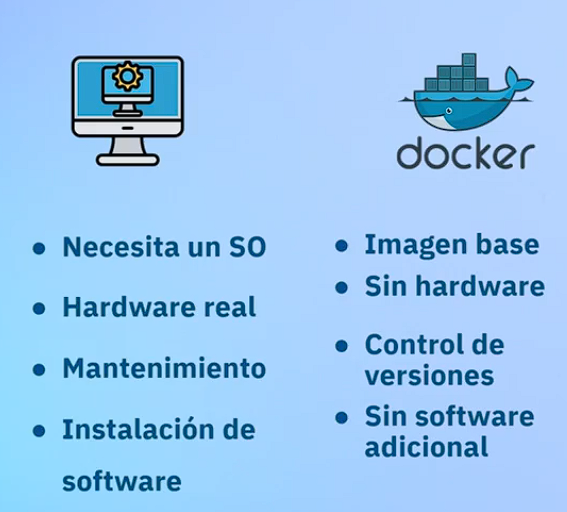
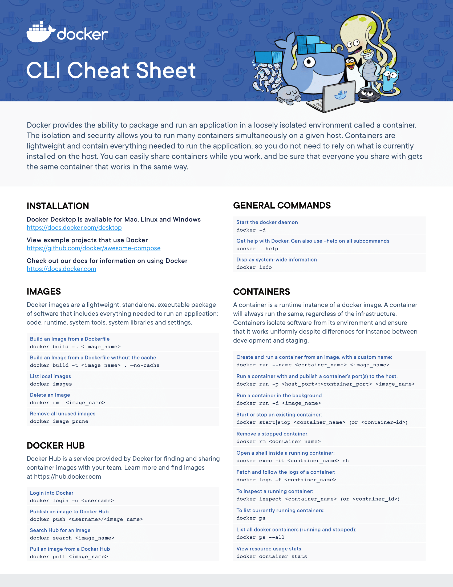
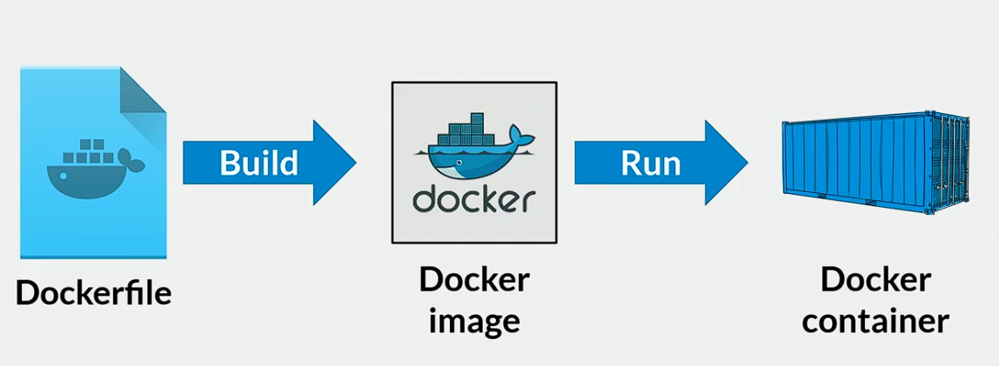

# Curso de Docker: Fundamentos

Docker es la herramienta de gestión de contenedores más popular de la industria, aprender Docker es la entrada al mundo de DevOps.


* 1. ## ¿Por qué aprender Docker?

### ¿Qué es Docker?

**Docker** es una plataforma de código abierto que automatiza el despliegue de aplicaciones dentro de contenedores. Un **contenedor** es una unidad ligera y portátil que incluye todo lo necesario para ejecutar una aplicación, cómo el código, las bibliotecas y las dependencias. DOcker facilita la creación, distribución y ejecución de aplicaciones en entornos consistentes y aislados. Esto mejora la eficiencia del desarrollo y la implementación, ya que las aplicaciones empacadas en contenedores pueden ejecutarse de manera consistente en cualquier entorno que admita Docker.

* 2. ## Diferencia entre Máquinas Virtuales, Contenedores y Servicios



### Máquinas virtuales

* Implementa un Sistema Operativo entero
* Utiliza hardware real, una parte física del hardware (entorno de red, ram, etc) esta siendo asignada a la máquina virtual.
* Es un entorno ideal para simulaciones.

### Contenedores (docker)

* **Entornos exactos**, ventaja ideal para uniformar los entornos de desarrollo.
* **Fragmentación**: podemos fragmentar los contenedores al nivel que queramos.
    * Podemos reducir nuestra solución de software a su mínima expresión, creando lo que se conoce como **Microservicio**
* Hardware limitado: pide solo una fracción de lo que pediria una Máquina Virtual, ya que contiene solo lo necesario para hacer funcionar la aplicación.
* **Escalabilidad:**

La enorme diferencia entre un contenedor y una máquina virtual radica en el aislamiento que tienen de sus entornos de trabajo: 

Las máquinas virtuales dependen desde el Hardware, Sistema Operativo y Software del equipo.

En el caso de los contenedores ninguna de estas capas es relevante.

#### Máquinas Virtuales (VMs)

1. **Definición**:

- Las VMs permiten ejecutar múltiples sistemas operativos en un solo hardware físico mediante la virtualización. Cada VM incluye su propio sistema operativo completo y una capa de virtualización que simula el hardware.

2. **Arquitectura**:

- **Hypervisor**: Una capa de software que permite crear y gestionar múltiples VMs. Los hypervisores pueden ser de tipo 1 (bare-metal) o tipo 2 (basados en host).

- **Sistemas Operativos**: Cada VM tiene su propio sistema operativo completo y aplicaciones.

3. **Aislamiento**:

- Aislamiento completo del sistema operativo y recursos, lo que proporciona alta seguridad, pero con mayor uso de recursos.

4. **Eficiencia**:

- Menos eficiente en términos de recursos debido a la necesidad de replicar sistemas operativos completos y overhead del hypervisor.

5. **Casos de Uso**:

- Adecuadas para ejecutar aplicaciones que requieren entornos completamente separados o diferentes sistemas operativos, y para consolidación de servidores.

#### Contenedores

1. **Definición**:

- Los contenedores encapsulan una aplicación y sus dependencias en un entorno aislado, pero comparten el mismo kernel del sistema operativo subyacente.

2. **Arquitectura**:

- **Docker Engine**: Una capa de software que permite la creación y gestión de contenedores.

- **Imagen de Docker**: Plantilla de solo lectura que incluye la aplicación y sus dependencias.

3. **Aislamiento**:

- Aislamiento a nivel de aplicación y librerías, compartiendo el mismo kernel del sistema operativo, lo que proporciona un balance entre aislamiento y eficiencia de recursos.

4. **Eficiencia**:

- Más eficientes en términos de recursos, ya que no requieren múltiples instancias del sistema operativo. Inician y se ejecutan más rápido que las VMs.

5. **Casos de Uso**:

- Ideales para desarrollar, desplegar y escalar aplicaciones de manera rápida y eficiente, especialmente en arquitecturas de microservicios y entornos de CI/CD.

#### Servicios

1. **Definición**:

- Un servicio es una unidad lógica de funcionalidad que realiza una tarea específica dentro de una aplicación. En el contexto de microservicios, cada servicio es autónomo y realiza una única función.

2. **Arquitectura**:

- **Monolítica vs Microservicios**: En una arquitectura monolítica, todos los servicios están integrados en una sola aplicación. En una arquitectura de microservicios, cada servicio es independiente y se comunica a través de APIs.

- **Despliegue**: Los servicios pueden desplegarse en contenedores, VMs o directamente en hardware físico.

3. **Aislamiento**:

- Aislamiento lógico, cada servicio opera de manera independiente, lo que permite desarrollar, desplegar y escalar servicios individualmente.

4. **Eficiencia**:

- Mejora la eficiencia de desarrollo y despliegue, ya que los equipos pueden trabajar de manera autónoma en diferentes servicios y desplegar actualizaciones sin afectar a toda la aplicación.

5. **Casos de Uso**:

- Perfecto para aplicaciones complejas y grandes que pueden beneficiarse de una arquitectura distribuida, como plataformas web de gran escala, sistemas de e-commerce y aplicaciones empresariales.

### Resumen Comparativo

| Aspecto | Máquinas Virtuales | Contenedores | Microservicio |
|--------------------------|-------------------------------|----------------------------------|-------------------------------|
| **Definición** | Simulan hardware completo | Encapsulan aplicaciones y dependencias | Funcionalidad específica dentro de una aplicación |
| **Arquitectura** | Hypervisor, VM, SO completo | Docker Engine, Imagen, Contenedor | Microservicios |
| **Aislamiento** | Completo a nivel de SO | A nivel de aplicación y librerías | Lógico a nivel de servicio |
| **Eficiencia** | Menos eficiente, alto overhead | Más eficiente, compartición de recursos | Alta eficiencia en desarrollo y despliegue |
| **Casos de Uso** | Diversos SOs, seguridad alta | Desarrollo ágil, microservicios | Aplicaciones distribuidas, escalabilidad independiente |

Cada tecnología tiene sus propias ventajas y es adecuada para diferentes escenarios y necesidades en la infraestructura y desarrollo de software.

* 3. ## Instalación de Docker

En Windows debemos instalar primero Windows Subsystem for Linux.
Que es un sistema Linux funcional dentro de Windows.
Debemos hacerlo para poder crear contenedores de Linux ya que es la mejor opción para crear Apps.

Luego debemos instalar Docker y activar las opciones para usar WSL

* 4. ## Conociendo Docker Desktop

- Contenedores: Contiene todas las dependencias y librerías para que una aplicación se ejecute en cualquier máquina fuera de la cual en la que fue construida.

- Images: Plantilla para la creación de contenedores.

- Volumes: Ayudan a persistir los datos que son creado dentro de un contenedor, esto debido a que si no se usa los datos se pierden cuando el contenedor se destruye, ya que son efímeros.

- Dev Environments: Son entornos de producción que ayudan a reducir los riesgos de versiones entre los equipos.

- Docker Scout: Es una herramienta para el monitoreo y gestión visual de los contenedores, permitiendo realizar acciones a través de una interfaz gráfica.

- Learning Center: Centro para aprender más sobre Docker.

* 5. ## Conociendo Docker CLI

Ver la versión de Docker instalada
```
docker --version
```

Ver la documentación de docker
```
docker
```

Ver la documentación de un comando en particular con el flag --help
```
docker command-name --help
```

Nos muestra mucho de la información de hardware usado por docker
```
docker info
```

Listar imagenes
```
docker images
```

Para listar los contenedores actualmente en ejecución:
```
docker ps
```
Listar todos los contenedores docker (en ejecución y parados):
```
docker ps --all
```



* 6. ## Mi primera imagen en docker

El proceso para llegar de un docker file a un docker container es el siguiente:

* El dockerfile contiene las instrucciones para crear la imagen docker
* La imagen es un paquete ejecutable ligero e independiente de software que incluye todo lo necesario para ejecutar una aplicación: código, tiempo de ejecución, herramientas del sistema, bibliotecas del sistema y configuraciones. 



```Dockerfile
# Como nosotros necesitamos una imagen con un servidor web
# vamos a traer un servicio de servidor web, en este caso nginx
FROM nginx:latest
# La palabra reservada FROM hara un pull de nginx

# Ahora copiaremos los archivos html a el servidor web
# nginx es una imagen basada en linux por lo que se usa la estructura de archivos de linux
# Path: /usr/share/nginx/html --> Todos los archivos que html que coloquemos aqui se van a volver un sitio web
COPY /linktree /usr/share/nginx/html
```